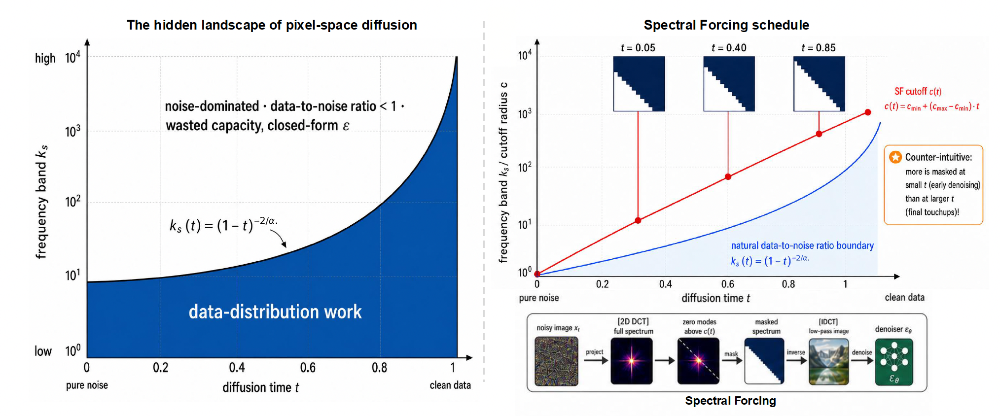

# Show the Signal, Hide the Noise: Spectral Forcing for Pixel-Space Diffusion

<div class="is-size-5 publication-authors", align="center">
              <!-- Paper authors -->
                <span class="author-block">
                  <a href="https://weichenfan.github.io/Weichen//" target="_blank">Weichen Fan</a><sup>1</sup>,</span>
                  <span class="author-block">
                    <a href="https://paranioar.github.io/" target="_blank">Haiwen Diao</a><sup>1</sup>,</span>
                  <span class="author-block">
                  <a href="https://penghao-wu.github.io/" target="_blank">Penghao Wu</a><sup>1</sup>,</span>
                  <span class="author-block">
                    <a href="https://liuziwei7.github.io/" target="_blank">Ziwei Liu</a><sup>1✉</sup>
                  </span>
                  </div>
<div class="is-size-5 publication-authors", align="center">
                    <span class="author-block">S-Lab, Nanyang Technological University<sup>1</sup> &nbsp;&nbsp;&nbsp;&nbsp; </span>
                    <span class="eql-cntrb"><small><br><sup>✉</sup>Corresponding Author.</small></span>
                  </div>

</p>

<div align="center">
                      <a href="https://arxiv.org/pdf/2606.15236">Paper</a> | <a href="https://huggingface.co/weepiess2383/Spectral_Forcing">Weights</a> 
</div>

---

Spectral Forcing (SF) is a parameter-free, input-side operator for pixel-space
diffusion / flow image generation. It applies a **time-conditional 2D-DCT
low-pass mask to the denoiser's noisy input**:

```
SF_t(z) = IDCT( DCT(z) ⊙ M(t) ),    M(t) = sigmoid( κ · (c(t) − r) )
```

where `r` is the normalized DCT radius and the radial cutoff `c(t) = c_min +
(c_max − c_min)·f(t)` grows from `c_min = 0.05` at `t = 0` to `c_max = 1.0`
(identity) at `t = 1`, with sharpness `κ = 30` and the linear schedule
`f(t) = t`. Early steps (mostly noise) keep only low frequencies; at the data
endpoint the mask is the identity. The forward process, v-prediction loss, EMA,
Heun sampler, and classifier-free guidance are all unchanged — SF is a drop-in
adapter costing ~0.5% extra compute (one forward + inverse DCT per step).


<p align="center">
  
</p>
<p align="center"><em>Left: the per-band data-to-noise ratio splits the (frequency, time) plane — a denoiser only does useful data-distribution work below the moving bandwidth front, while capacity above it is spent on a noise-dominated, closed-form solution. Right: Spectral Forcing applies a time-conditional 2D-DCT low-pass (DCT → mask → IDCT) to the network's input whose cutoff tracks that front, so only the signal-bearing low frequencies pass early and the full spectrum passes at the data endpoint.</em></p>

## Installation

```bash
conda create -n sf python=3.10 -y
conda activate sf
pip install uv
uv pip install -r requirements.txt
```

## Dataset

Download [ImageNet](http://image-net.org/download) and point `IMAGENET_ROOT` at
the directory that contains `train/`.

## Training

Runs go through `run_jit_multinode.sh`, configured by environment variables (run
`./run_jit_multinode.sh --help` for the full list). Examples are for one 8-GPU
node; W&B defaults to `offline`. Flags after `./run_jit_multinode.sh` are
forwarded to `main_jit.py`. The paper uses three fixed-patch configs:

| Config | `MODEL` | patch size | tokens @ 256² |
|---|---|---|---|
| 130M/32 | `JiT-B/32` | 32 | 64 |
| 130M/16 | `JiT-B/16` | 16 | 256 |
| 700M/32 | `JiT-700M` | 32 | 64 |

**Baseline (vanilla JiT, no spectral forcing)** — e.g. JiT-B/32:

```bash
IMAGENET_ROOT=/path/to/imagenet \
MODEL='JiT-B/32' IMG_SIZE=256 \
OUTPUT_DIR=output/jit_b32_baseline \
./run_jit_multinode.sh --disable_dct_patchify
```

**Linear Spectral Forcing** (full-image DCT) — JiT-B/32:

```bash
IMAGENET_ROOT=/path/to/imagenet \
MODEL='JiT-B/32' IMG_SIZE=256 \
OUTPUT_DIR=output/jit_b32_linear_sf \
./run_jit_multinode.sh
```

The DCT low-pass is applied over the full image — `window_size` defaults to
`img_size`, so no extra flag is needed; just change `MODEL` (and `IMG_SIZE`) for
the other configs. The SF settings (linear schedule, `c_min=0.05`, `c_max=1.0`,
`κ=30`) are the defaults in `model_jit.py`. To run SF with a time-independent
(constant) mask, add `--disable_dct_scale_schedule --dct_fixed_scale 1.0`.

## Evaluation

Set `EVALUATE_GEN=1` and point `RESUME` at a directory containing
`checkpoint-last.pth`. Pass the **same architecture flags used for training** so
the model matches the checkpoint (e.g. add `--disable_dct_patchify` when
evaluating a baseline checkpoint). Evaluation generates `--num_images` samples and
reports FID/IS against the precomputed reference stats in `fid_stats/` (256/512).

```bash
IMAGENET_ROOT=/path/to/imagenet \
MODEL='JiT-B/32' IMG_SIZE=256 \
GEN_BSZ=125 EVALUATE_GEN=1 \
OUTPUT_DIR=output/jit_b32_linear_sf \
RESUME=output/jit_b32_linear_sf \
./run_jit_multinode.sh
```

`prepare_ref.py` can regenerate a reference image folder if you want to recompute
the FID statistics yourself.


## Acknowledgements

Built on the [JiT](https://github.com/LTH14/JiT) codebase.
## BibTex
```bibtex
@misc{fan2026show,
  title         = {{Show the Signal, Hide the Noise: Spectral Forcing for Pixel-Space Diffusion}},
  author        = {Fan, Weichen and Diao, Haiwen and Wu, Penghao and Liu, Ziwei},
  year          = {2026},
  eprint        = {2606.15236},
  archivePrefix = {arXiv},
  primaryClass  = {cs.CV},
  doi           = {10.48550/arXiv.2606.15236},
  url           = {https://arxiv.org/abs/2606.15236}
}
```
